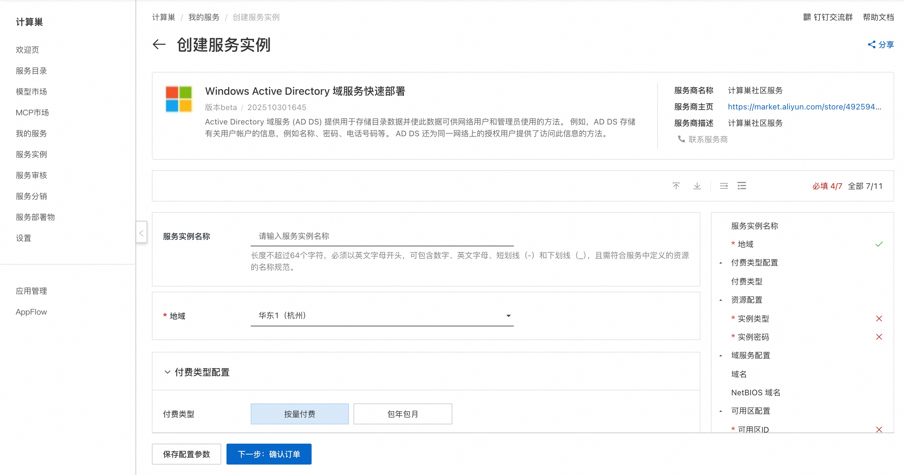
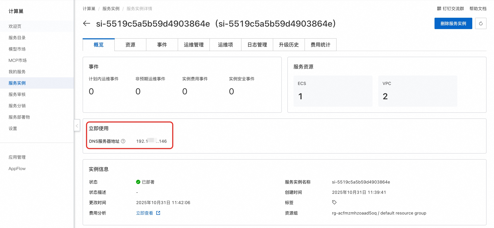
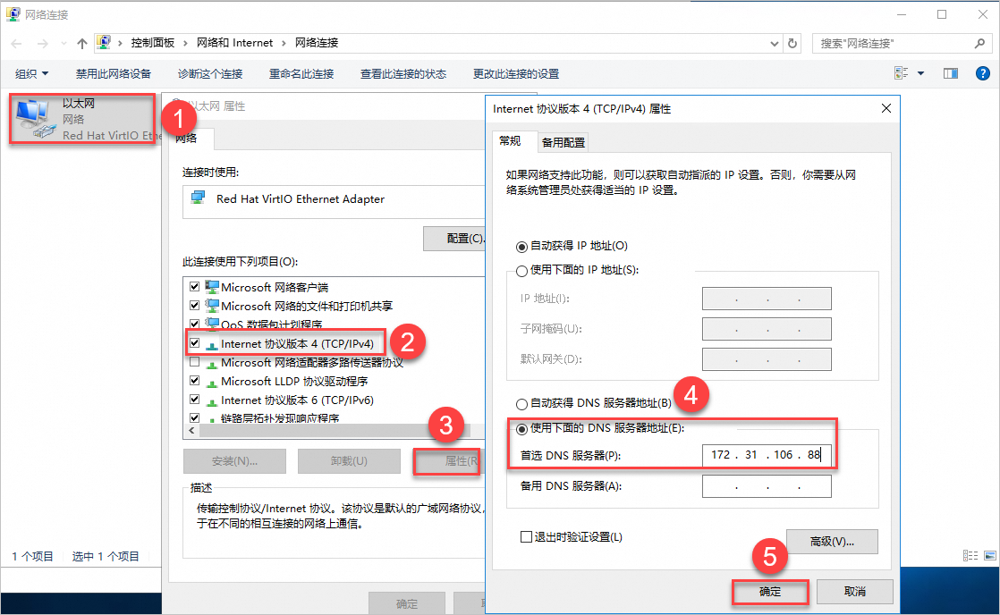
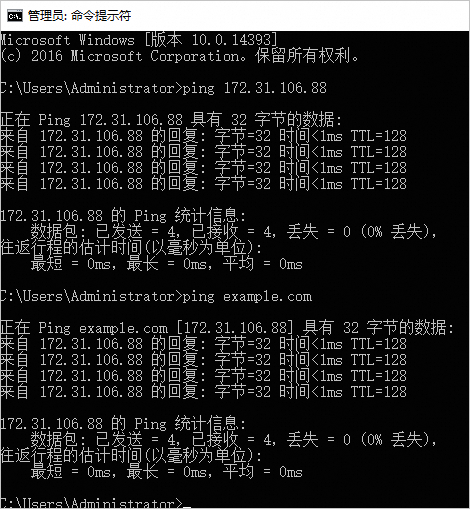
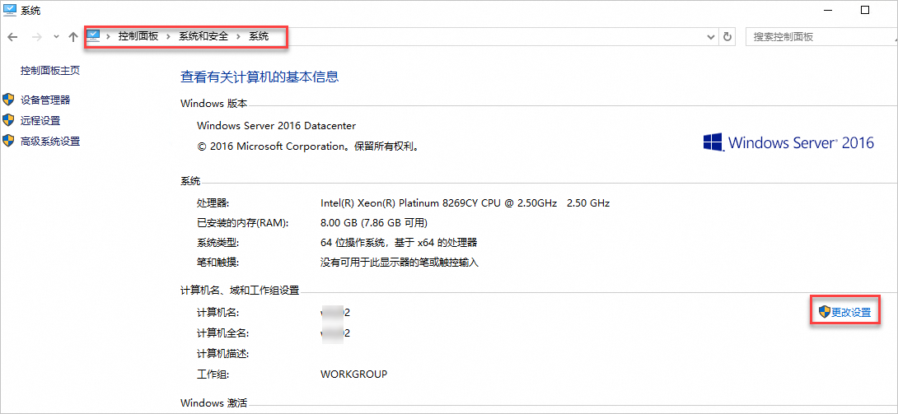
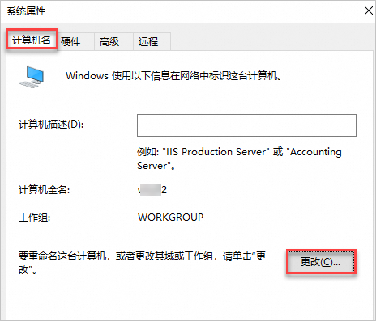
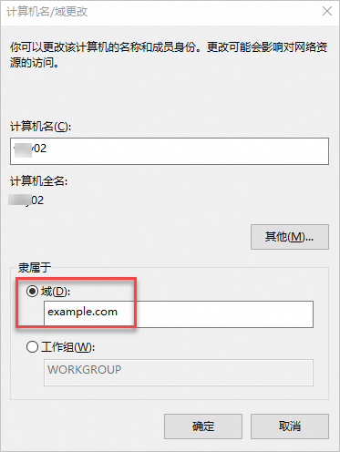
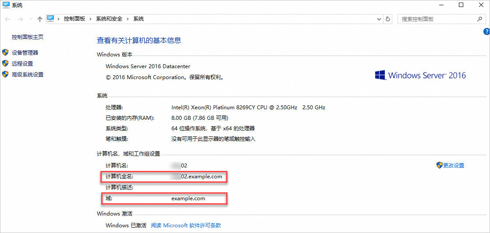

## 🌟 服务简介

Active Directory 域服务 (AD DS) 提供用于存储目录数据并使此数据可供网络用户和管理员使用的方法。 例如，AD DS 存储有关用户账户的信息，例如名称、密码、电话号码等。 AD DS 还为同一网络上的授权用户提供了访问此信息的方法。

## 🚀 部署流程

1. 访问计算巢 AD DS 社区版[部署链接](https://computenest.console.aliyun.com/service/instance/create/cn-hangzhou?type=user&ServiceId=service-1e33cc6c839842ccb5d8)，按提示填写部署参数：
   

2. 参数填写完成后可以看到对应询价明细，确认参数后点击**下一步：确认订单**。

3. 确认订单完成后同意服务协议并点击**立即创建**进入部署阶段。

4. 等待部署完成后进入服务实例详情页，获取DNS服务器地址。
   

## 🔨 将客户端加入AD域
1. 远程连接作为客户端的ECS实例。 具体操作，请参见[连接实例](https://help.aliyun.com/zh/ecs/user-guide/connect-to-instance?spm=a2c4g.11186623.0.0.57357146IMK01t)。

2. 修改客户端DNS服务器地址。将客户端的DNS服务器地址更改为您上一步已获取的DNS服务器地址。
    

3. 检查是否能ping通DNS服务器IP地址。

    如图所示，正常返回相关参数，表示可以ping通DNS服务器。
    

4. 将客户端加入到AD域中。

    a. 进入控制面板的系统页面。 在桌面左下角单击搜索.jpg图标，在搜索框输入控制面板，并在搜索结果中单击控制面板。 选择系统和安全 > 系统。

    b. 在计算机名、域和工作组设置区域右侧，单击更改设置。
    

    c. 在系统属性页面，单击更改。
    

    d. 在计算机名/域更改页面，添加AD域信息。请填写步骤一：部署AD域控制器设置的AD域根域名，本文示例为example.com。
    

    e. 重新启动服务器，使修改生效。

5. 如果您的计算机信息中自动加上了AD域的根域名，则表示该客户端已成功加入AD域。
    

# 📚 使用指南

更多用法请参考AD DS [官网文档](https://learn.microsoft.com/zh-cn/windows-server/identity/ad-ds/get-started/virtual-dc/active-directory-domain-services-overview)。
